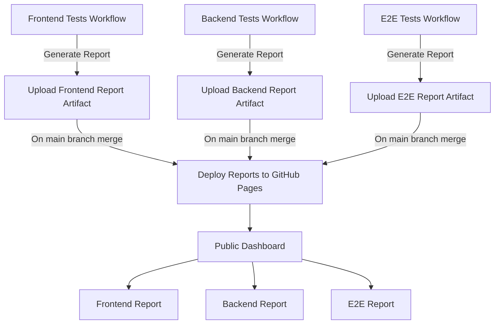

# Pet Tracker - My app + QA Project


A pet health management application including multi-layer test automation, CI/CD pipeline, and test reporting.
Still a work in progress. Check out the [SETUP.md](SETUP.md) guide for detailed installation and configuration instructions.


## CI/CD Pipeline

[Pipeline](https://github.com/nora-berth/Pet-tracker/actions)
[Test Reports](https://nora-berth.github.io/Pet-tracker/)

### Pipeline Architecture




## Tech Stack

### Application
- **Backend**: Django + Django REST Framework
- **Frontend**: React + Vite + React Router
- **Database**: PostgreSQL (Docker)
- **API**: RESTful

### Testing & QA
- **Backend Testing**: Pytest
- **Frontend Testing**: Vitest + React Testing Library
- **E2E Testing**: Playwright
- **Test Reporting**: Allure (with Pytest, Vitest, Playwright integrations)
- **CI/CD**: GitHub Actions


## Project Structure

```
pet-tracker/
├── .github/workflows/
│   ├── frontend-tests.yml
│   ├── backend-tests.yml
│   ├── e2e-tests.yml
│   └── deploy-reports-pages.yml
├── scripts/
│   └── generate-report.sh
├── backend/
│   ├── config/
│   ├── pets/
│   │   ├── models.py     
│   │   ├── views.py
│   │   ├── serializers.py   
│   │   └── tests/
│   │       ├── test_models.py 
│   │       └── test_api.py
│   ├── pytest.ini     
│   ├── requirements.txt
│   └── manage.py
├── frontend/
│   ├── e2e/
│   │   ├── pet-management.spec.js
│   │   ├── fixtures/
│   │   │   └── pet-fixtures.js
│   │   └── helpers/
│   │       └── api-helpers.js
│   ├── src/
│   │   ├── App.test.jsx
│   │   ├── components/
│   │   ├── pages/
│   │   ├── services/
│   │   └── test/
│   │       ├── setup.js
│   │       └── allure-helpers.js
│   ├── playwright.config.js
│   ├── vite.config.js
│   └── package.json
├── docker-compose.yml
├── CLAUDE.md
├── README.md
└── SETUP.md
```


## Contact

**Nora Bertholome** - QA Engineer

GitHub: [@nora-berth](https://github.com/nora-berth)


**Built with ❤️ for my pets and as my personal QA project**
