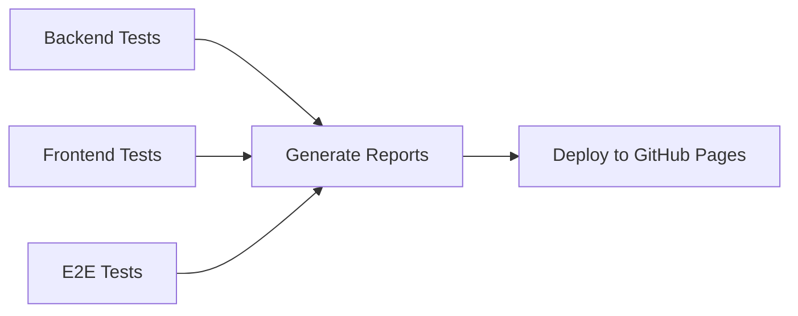

# Pet Tracker - My app + QA Project


A pet health management application including multi-layer test automation, CI/CD pipeline, and test reporting.
Still a work in progress. Check out the [SETUP.md](SETUP.md) guide for detailed installation and configuration instructions.


**[Test Reports with Allure](https://nora-berth.github.io/Pet-tracker/)**


## Test Architecture

### Backend Tests
**Location**: `backend/pets/tests/`

- **Framework**: Pytest with Django integration
- **Test Files**:
  - [test_models.py](backend/pets/tests/test_models.py) - Model layer validation (Pet, WeightRecord, Vaccination, VetVisit)
  - [test_api.py](backend/pets/tests/test_api.py) - REST API CRUD operations, error handling, validation

### Frontend Tests
**Location**: `frontend/src/`

- **Framework**: Vitest + React Testing Library
- **Test Files**:
  - [App.test.jsx](frontend/src/App.test.jsx) - Component tests

### End-to-End Tests
**Location**: `frontend/e2e/`

- **Framework**: Playwright
- **Test Files**:
  - [pet-management.spec.js](frontend/e2e/pet-management.spec.js) - Critical user paths
  - [fixtures/pet-fixtures.js](frontend/e2e/fixtures/pet-fixtures.js) - Test data management
  - [helpers/api-helpers.js](frontend/e2e/helpers/api-helpers.js) - API utilities for test setup


## CI/CD Pipeline

**Pipeline**: [view CI](https://github.com/nora-berth/Pet-tracker/actions)

### Pipeline Architecture



#### Job 1: Backend Tests
- Python 3.11 + pytest
- PostgreSQL 16 service with health checks
- Coverage reporting (XML + terminal)
- Allure results artifact

#### Job 2: Frontend Unit Tests
- Node 20 + Vitest
- Unit test execution
- Allure results artifact

#### Job 3: E2E Tests
- Full environment setup (Python + Node + PostgreSQL)
- Database migrations
- Django development server
- Playwright browser installation
- HTML report + Allure results

#### Job 4: Generate Reports
- Runs on success/failure
- Allure CLI 2.25.0 aggregates all test results
- Combined HTML report generation

#### Job 5: Deploy to GitHub Pages
- Deployment for main branch reports
- GitHub Pages integration
- Public test report hosting


## Tech Stack

### Application
- **Backend**: Django + Django REST Framework
- **Frontend**: React + Vite + React Router
- **Database**: PostgreSQL (Docker)
- **API**: RESTful with ViewSets and nested serializers

### Testing & QA
- **Backend Testing**: Pytest + Pytest-Django + Pytest-cov
- **Frontend Testing**: Vitest + React Testing Library
- **E2E Testing**: Playwright
- **Test Reporting**: Allure (with Pytest, Vitest, Playwright integrations)
- **CI/CD**: GitHub Actions with multi-job workflow


## Project Structure

```
pet-tracker/
├── .github/workflows/
│   └── ci.yml
├── backend/
│   ├── config/
│   ├── pets/
│   │   ├── models.py     
│   │   ├── views.py
│   │   ├── serializers.py   
│   │   └── tests/
│   │       ├── test_models.py 
│   │       └── test_api.py
│   ├── pytest.ini     
│   ├── requirements.txt
│   └── manage.py
├── frontend/
│   ├── e2e/
│   │   ├── pet-management.spec.js
│   │   ├── fixtures/
│   │   │   └── pet-fixtures.js
│   │   └── helpers/
│   │       └── api-helpers.js
│   ├── src/
│   │   ├── App.test.jsx
│   │   ├── components/
│   │   ├── pages/
│   │   ├── services/
│   │   └── test/
│   │       ├── setup.js
│   │       └── allure-helpers.js
│   ├── playwright.config.js
│   ├── vite.config.js
│   └── package.json
├── docker-compose.yml
├── CLAUDE.md
├── README.md
└── SETUP.md
```


## Contact

**Nora Bertholome** - QA Engineer

GitHub: [@nora-berth](https://github.com/nora-berth)


**Built with ❤️ for my pets and as my personal QA project**
